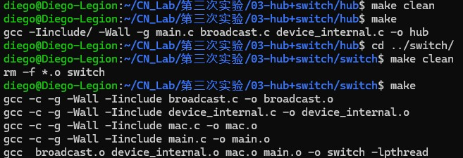
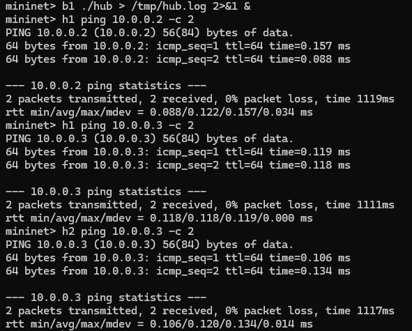
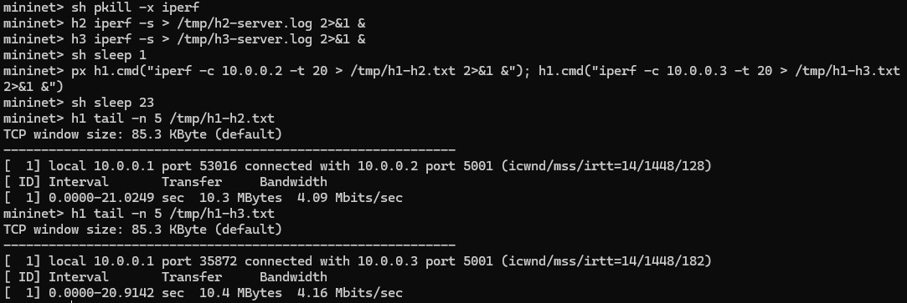
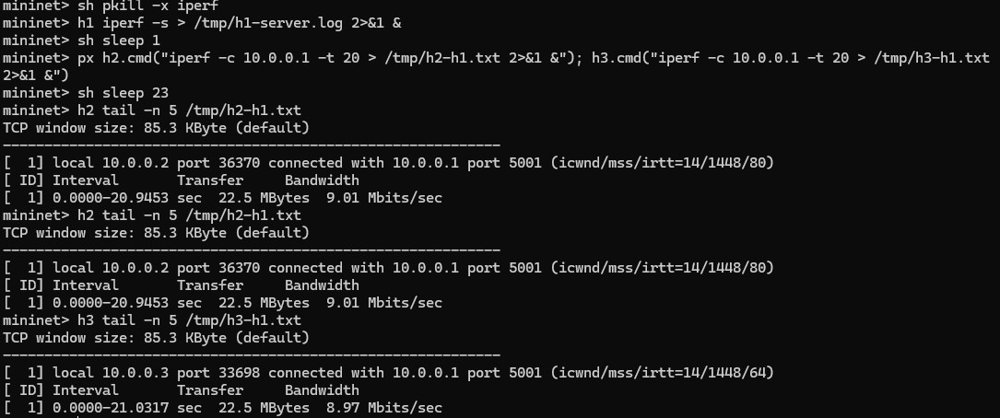
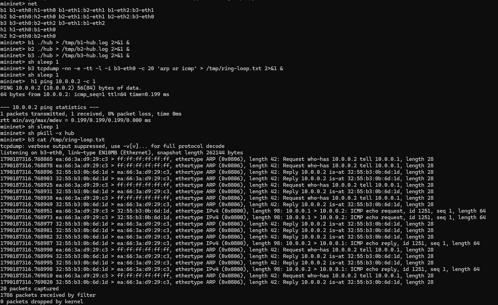
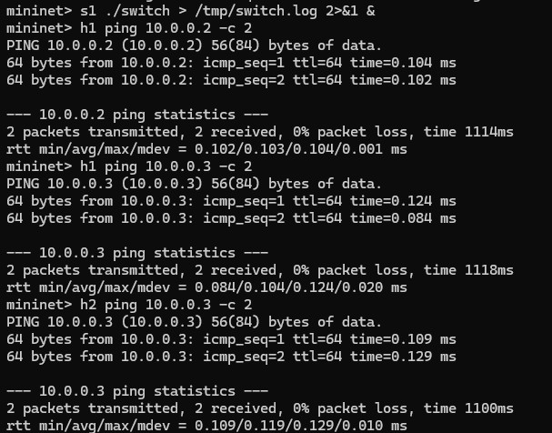
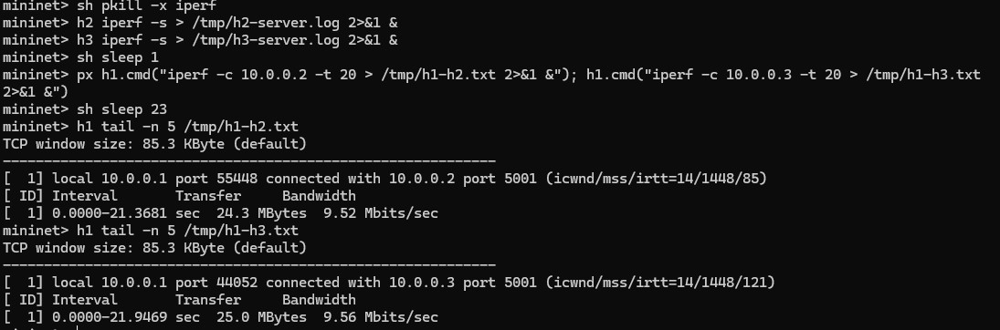
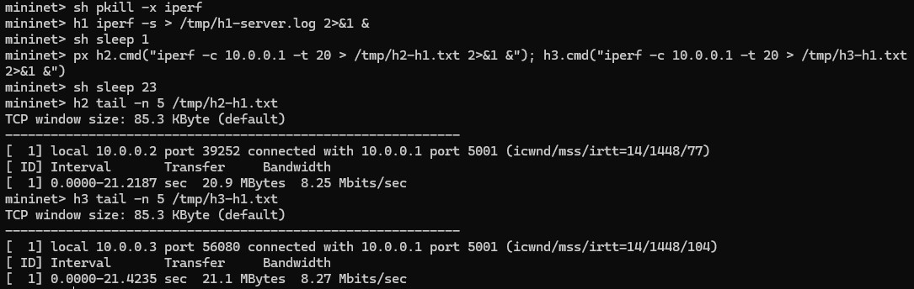

# 广播网络与交换机转发实验报告

张晨轩2024K8009929011

## 1 实验题目

1. 广播网络实验：实现Hub的数据包广播，并观察广播网络中的连通性、带宽利用率以及环路问题。
2. 交换机转发实验：实现MAC地址学习、转发表老化与数据包转发，并对比Switch与Hub的链路利用效率。

## 2 实验目的

1. 理解以太网帧、MAC地址以及二层转发的基本过程。
2. 掌握Hub的广播方式，并分析广播所带来的冗余流量与环路问题。
3. 掌握交换机的源地址学习、目的地址查询、未知单播广播和表项老化机制。
4. 借助链表、哈希表、线程与互斥锁，实现一个并发安全的MAC转发表。

## 3 实验原理

### 3.1 以太网帧与MAC地址

本实验直接处理二层以太网帧，帧头中最重要的字段是6字节的目的MAC地址和源MAC地址。中间节点收到帧之后，需要依据目的MAC决定从哪些端口发送；同时，源MAC与入口端口之间的关系，也可以用于学习主机的位置。

### 3.2 Hub广播

Hub并不保存任何主机位置信息，从某个端口收到数据包后，会把原数据包从除入口以外的所有端口发送出去。

这样的实现能够保证此前未知的主机也收到数据，但其他无关主机同样会收到副本，因此会浪费链路带宽。

### 3.3 广播环路

如果多个Hub组成环形拓扑，一个广播帧可能被相邻Hub不断复制并重新送回。二层帧没有用于限制转发次数的TTL，本实验中的Hub也没有去重机制，因此数据包会在环中持续传播。

### 3.4 交换机学习和转发

交换机维护一张“MAC地址到端口”的转发表。收到数据包时，源MAC表明该主机可通过入口端口到达，所以交换机会学习或更新`源MAC -> 入口端口`。

随后依据目的MAC查询转发表：

- 查询成功且出口与入口不同：仅从对应端口转发。
- 查询成功但出口与入口相同：无需再次发送，直接过滤。
- 查询失败：向入口以外的所有端口广播。

交换机刚启动时转发表为空，所以最初的ARP或未知单播仍需要广播。通信进行之后，交换机逐渐学到各主机所在的端口，后续数据便可定向转发。

### 3.5 哈希表、老化和互斥

程序将MAC地址通过`hash8`映射到256个哈希桶，每个桶使用双向链表解决哈希冲突。与把所有表项放在同一链表相比，这样可以减少一次查询需要遍历的表项数。

每条记录还保存最近一次从该源MAC收到数据包的时间。老化线程每秒检查一次表项，把超过30秒未更新的记录删除，使交换机能够适应主机移动或拓扑变化。

主线程可能正在查询或者更新转发表，老化线程也有可能同时删除表项，所以查询、插入、更新和删除这些操作，都需要用同一把互斥锁保护起来。删除链表元素时还要使用安全遍历宏，以免访问到已经释放的节点。

## 4 程序实现

### 4.1 Hub广播实现

在`hub/broadcast.c`中实现`broadcast_packet`。程序会遍历`instance->iface_list`，跳过收到数据包的入口端口，其余端口则调用`iface_send_packet`。数据包内存由上层`handle_packet`统一释放，广播函数不重复释放。

### 4.2 Switch广播实现

`switch/broadcast.c`与Hub的广播逻辑相同，仅在目的MAC无法从转发表中找到时调用。广播同样必须排除入口端口，否则会把数据包立即发回来源方向。

### 4.3 MAC转发表实现

在`switch/mac.c`中实现以下操作：

1. `lookup_port`：计算目的MAC的哈希值，在对应桶中逐项比较完整的6字节MAC，找到后就返回端口。
2. `insert_mac_port`：如果源MAC已经存在，则更新端口和访问时间；如果不存在，则分配新表项并加入对应哈希桶。
3. `sweep_aged_mac_port_entry`：遍历全部哈希桶，删除超过`MAC_PORT_TIMEOUT`的表项，并返回删除数量。

上述操作都使用`mac_port_map.lock`保护，避免查询线程与老化线程同时修改链表。

### 4.4 Switch数据包处理

在`switch/main.c`的`handle_packet`中，一是检查数据长度是否包含完整以太网头。合法数据包先根据源MAC学习入口，再查询目的MAC。查询不到MAC时则广播，否则进行单播转发，并统一释放接收数据时申请的内存。

## 5 实验流程

### 5.1 编译

分别进入Hub和Switch目录，使用附件中的原始Makefile编译：

```bash
cd 03-hub+switch/hub
make clean
make

cd ../switch
make clean
make
```



### 5.2 Hub连通性测试

启动Hub拓扑：

```bash
cd 03-hub+switch/hub
sudo python3 three_nodes_bw.py
```

在Mininet中启动Hub，并进行两次ping测试：

```text
mininet> b1 ./hub > /tmp/hub.log 2>&1 &
mininet> h1 ping 10.0.0.2 -c 2
mininet> h1 ping 10.0.0.3 -c 2
mininet> h2 ping 10.0.0.3 -c 2
```



### 5.3 Hub带宽测试

1. H2和H3作为服务端，H1向二者发送数据：

```text
mininet> sh pkill -x iperf
mininet> h2 iperf -s > /tmp/h2-server.log 2>&1 &
mininet> h3 iperf -s > /tmp/h3-server.log 2>&1 &
mininet> sh sleep 1
mininet> px h1.cmd("iperf -c 10.0.0.2 -t 20 > /tmp/h1-h2.txt 2>&1 &"); h1.cmd("iperf -c 10.0.0.3 -t 20 > /tmp/h1-h3.txt 2>&1 &")
mininet> sh sleep 23
mininet> h1 tail -n 5 /tmp/h1-h2.txt
mininet> h1 tail -n 5 /tmp/h1-h3.txt
```

2. H1作为服务端，H2和H3向H1发送数据：

```text
mininet> sh pkill -x iperf
mininet> h1 iperf -s > /tmp/h1-server.log 2>&1 &
mininet> sh sleep 1
mininet> px h2.cmd("iperf -c 10.0.0.1 -t 20 > /tmp/h2-h1.txt 2>&1 &"); h3.cmd("iperf -c 10.0.0.1 -t 20 > /tmp/h3-h1.txt 2>&1 &")
mininet> sh sleep 23
mininet> h2 tail -n 5 /tmp/h2-h1.txt
mininet> h3 tail -n 5 /tmp/h3-h1.txt
```





### 5.4 Hub环路测试

为了验证广播网络中的数据包环路，这里构建了由三个广播节点`b1`、`b2`、`b3`组成的环形拓扑。其中，H1连接到b1，H2连接到b2，三个广播节点通过`b1-b2`、`b2-b3`和`b3-b1`三条链路构成闭环。

拓扑示意图如下：

```
h1 -- b1 -- b2 -- h2
       \    /
         b3
```

分别在三个广播节点上启动Hub程序：

```text
mininet> b1 ./hub > /tmp/b1-hub.log 2>&1 &
mininet> b2 ./hub > /tmp/b2-hub.log 2>&1 &
mininet> b3 ./hub > /tmp/b3-hub.log 2>&1 &
```

随后在`b3-eth0`接口上启动`tcpdump`，让它只抓ARP或ICMP帧，并把数量限定在20帧；等抓包启动之后，再由H1向H2发出一个ICMP请求：

```text
mininet> b3 tcpdump -nn -e -tt -l -i b3-eth0 -c 20 'arp or icmp' > /tmp/ring-loop.txt 2>&1 &
mininet> sh sleep 1
mininet> h1 ping 10.0.0.2 -c 1
mininet> sh sleep 1
mininet> sh pkill -x hub
mininet> b3 cat /tmp/ring-loop.txt
```

H1明明只发了一次ping，可`tcpdump`很快就到达20帧的抓取上限，统计信息里还显示有1786个数据包到达过滤器；抓到的内容中，源MAC、目的MAC、协议和长度都相同的ARP请求、ARP应答以及ICMP帧一再重复出现，说明同一批数据包正在三个Hub之间被反复复制、转发，也就验证了简单广播网络并不具备环路抑制的能力。



### 5.5 Switch连通性测试

启动Switch拓扑并测试：

```bash
cd 03-hub+switch/switch
sudo python3 three_nodes_bw.py
mininet> s1 ./switch > /tmp/switch.log 2>&1 &
mininet> h1 ping 10.0.0.2 -c 2
mininet> h1 ping 10.0.0.3 -c 2
mininet> h2 ping 10.0.0.3 -c 2
```



### 5.6 Switch带宽测试

测试Switch时，持续时间和并发启动方式都与Hub保持一致。第一组仍由H1同时向H2、H3发送数据：

```text
mininet> sh pkill -x iperf
mininet> h2 iperf -s > /tmp/h2-server.log 2>&1 &
mininet> h3 iperf -s > /tmp/h3-server.log 2>&1 &
mininet> sh sleep 1
mininet> px h1.cmd("iperf -c 10.0.0.2 -t 20 > /tmp/h1-h2.txt 2>&1 &"); h1.cmd("iperf -c 10.0.0.3 -t 20 > /tmp/h1-h3.txt 2>&1 &")
mininet> sh sleep 23
mininet> h1 tail -n 5 /tmp/h1-h2.txt
mininet> h1 tail -n 5 /tmp/h1-h3.txt
```



第二组则反过来，由H2、H3同时向H1发送数据：

```text
mininet> sh pkill -x iperf
mininet> h1 iperf -s > /tmp/h1-server.log 2>&1 &
mininet> sh sleep 1
mininet> px h2.cmd("iperf -c 10.0.0.1 -t 20 > /tmp/h2-h1.txt 2>&1 &"); h3.cmd("iperf -c 10.0.0.1 -t 20 > /tmp/h3-h1.txt 2>&1 &")
mininet> sh sleep 23
mininet> h2 tail -n 5 /tmp/h2-h1.txt
mininet> h3 tail -n 5 /tmp/h3-h1.txt
```



## 6 实验结果

### 6.1 编译与连通性

在WSL中使用Makefile编译。按照课程建议使用`ping dst_ip -c 2`进行Mininet验证，H1到H2、H1到H3、H2到H3在Hub和Switch下均为2个数据包全部收到，丢包率为0%。

### 6.2 iperf数据

| 中间节点 | 流量方向 | 流1（Mbit/s） | 流2（Mbit/s） | 有效总吞吐率（Mbit/s） |
| --- | --- | ---: | ---: | ---: |
| Hub | H1→H2、H1→H3 | 4.09 | 4.16 | 8.25 |
| Switch | H1→H2、H1→H3 | 9.52 | 9.56 | 19.08 |
| Hub | H2→H1、H3→H1 | 9.01 | 8.97 | 17.98 |
| Switch | H2→H1、H3→H1 | 8.25 | 8.27 | 16.52 |

在H1同时向H2、H3发送的场景里，有效总吞吐率从Hub的8.25 Mbit/s提到了Switch的19.08 Mbit/s，提升约为$(19.08-8.25)\div8.25\times100\%\approx131.3\%$，也就是Switch大约为Hub的2.31倍；换到H2、H3同时向H1发送的场景，Hub和Switch分别是17.98 Mbit/s和16.52 Mbit/s，Switch低了约8.1%，两者总体上比较接近。

### 6.3 环路结果

在`b1-b2-b3-b1`环形拓扑中，先是在`b3-eth0`上启动`tcpdump`，再由H1向H2只发一次ping；抓包程序很快就到了20帧的数量上限，同时还显示有1786个数据包到达过滤器。抓取结果里，相同的ARP请求、ARP应答、ICMP请求和ICMP应答在极短时间内反复出现，证明Hub广播在环形拓扑中产生了数据包环路。测试完成后用`pkill`停止Hub程序，终止数据包的持续传播。

### 6.4 OJ测试结果


## 7 实验结果分析

### 7.1 Hub与Switch连通性

Hub不需要知道目的主机的位置，只要把帧复制到其他所有端口，目的主机最终就能收到。Switch在转发表为空时也会广播未知目的帧，所以两者都可以完成最初的ARP和ping。Switch在看到源MAC后会逐步建立转发表，后续帧便可以直接从正确端口发送。

第一次ping的首包延迟通常较高，这主要来自ARP解析和交换机最初的未知目的广播，并不表示后续转发持续缓慢。判断连通性时，应同时观察后续数据包和丢包率。

### 7.2 H1同时向H2、H3发送时的差异

H2和H3的链路分别只有10 Mbps。Hub收到发往H2的帧时还会把副本发给H3，收到发往H3的帧时也会把副本发给H2。因此，两条10 Mbps出口链路都同时承载了有用流量和与本主机无关的流量。无关副本占用了出口带宽，使两条业务流的有效吞吐率下降。

Switch学到H2和H3的端口之后，发往H2的帧只走H2链路，发往H3的帧只走H3链路，这样就能把两条出口更充分地用起来。本次实测下来，Hub的总吞吐率是8.25 Mbit/s，Switch到了19.08 Mbit/s，大约是Hub的2.31倍，说明定向转发确实把链路利用效率明显提上去了。

### 7.3 H2、H3同时向H1发送时的差异

H2和H3各自最多发送约10 Mbps，两条有效流量汇聚到H1的20 Mbps链路，理论上正好匹配瓶颈容量。Hub确实会把H2的数据复制到H3、把H3的数据复制到H2，但这些无关副本使用的是相反方向的链路容量。由于实验链路为全双工，反方向流量不一定与客户端向Hub发送的方向直接争抢带宽。

理论上讲，这个方向上Switch与Hub的差距可能小于H1同时向H2、H3发送时的差距，毕竟无关副本主要占用的是反方向容量。这次实验里，Hub和Switch的有效总吞吐率分别是17.98 Mbit/s和16.52 Mbit/s，相差约8.1%，基本处在同一量级，也符合该方向上广播副本与有效流量不直接争抢同向带宽的分析。

### 7.4 广播环路成因

Hub对收到的数据包没有历史记录，也不会修改帧中的跳数。环中的每个Hub都会再次向其他端口复制广播帧，使同一帧沿多个方向反复传播。持续复制会占满链路和处理资源，最终影响正常通信。该现象说明二层网络不能只依靠简单广播连接任意拓扑，还需要生成树等环路控制机制。

## 8 实验结论

本实验实现了Hub广播和具有自学习能力的二层交换机。Hub能够保证主机互通，但会把每个帧复制到无关端口，造成带宽浪费，并且在环形拓扑中会形成持续的数据包环路。Switch通过学习源MAC与入口端口的关系建立转发表，对已知目的地址进行定向转发；哈希表提高查询效率，老化机制使转发表适应拓扑变化，互斥锁保证主线程和老化线程并发访问时的数据一致性。本轮本地并发测试里，在广播副本与有效流量竞争同向链路的场景下，Switch的总吞吐率大约达到了Hub的2.31倍，也体现出定向转发对链路利用效率的明显提升。
