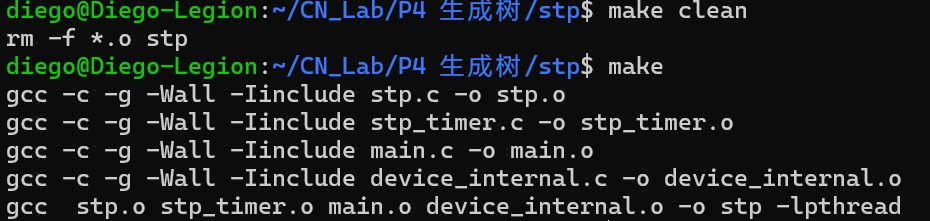
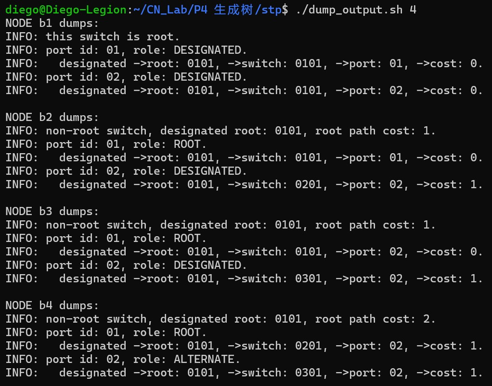
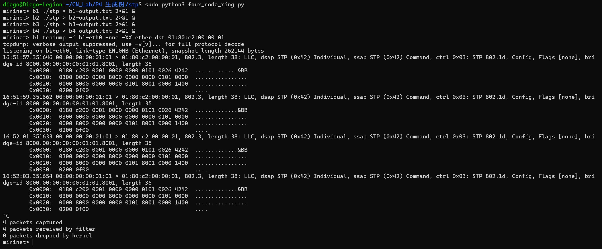
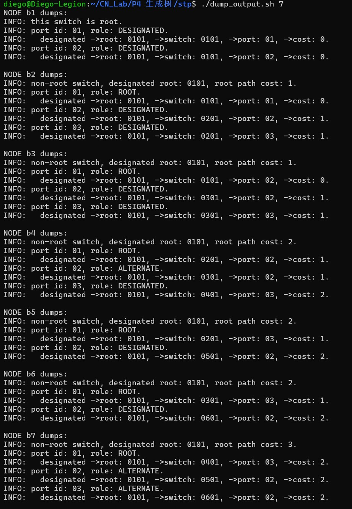
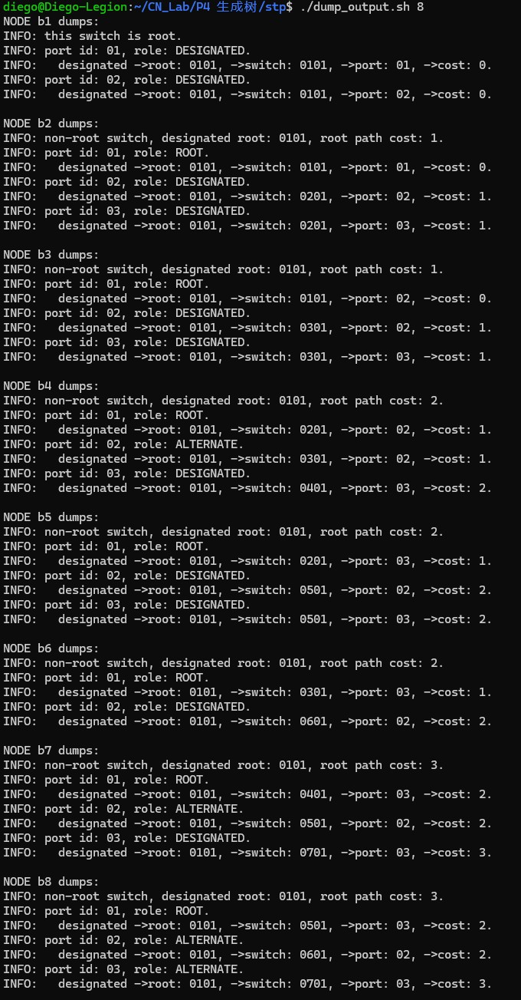
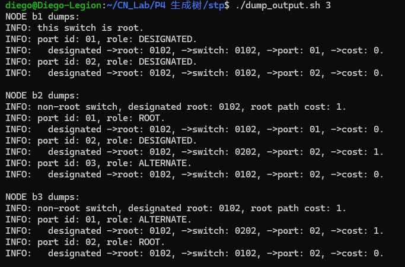

# 生成树机制实验报告

张晨轩2024K8009929011

## 1 实验题目

本实验要实现一个简化过的生成树协议，在存在环路的二层网络当中把根节点选举出来、把各个端口的角色确定下来，并且通过阻塞冗余端口的方式，生成一棵没有环路的生成树。

## 2 实验目的

1. 要理解二层网络当中为什么会出现环路，以及广播风暴的产生原因。
2. 要理解生成树协议里根节点、根端口、指定端口和备用端口各自的含义。
3. 要掌握Config报文的优先级是怎样比较的、根路径开销是如何计算的，以及端口角色的更新过程包含哪些步骤。
4. 要在四节点环形拓扑、自定义的七节点拓扑、八节点复杂拓扑，还有STP节点与Hub共存的拓扑当中，验证生成树的收敛结果。

## 3 实验原理

### 3.1 生成树的作用

当交换节点之间出现环路的时候，同一个二层帧就有可能被一次又一次地复制并转发出去；生成树协议的做法是把一个根节点选出来，再把一部分冗余端口置为备用状态，这样保留下来的那些链路既能把全部节点连接起来，同时也不会再包含环路。

### 3.2 节点ID和端口ID

节点ID是由16位优先级和48位MAC地址一起构成的；本实验里面，各个节点的优先级都取32768，所以MAC地址比较小的那个节点，它的节点ID也会比较小。端口ID则是由8位优先级和8位端口编号组成的，端口的默认优先级为128。

### 3.3 Config报文及优先级

每一个端口上面都会保存一份当前已经知道的最优Config信息，其中包含根节点ID、到根节点的路径开销、发送节点ID和发送端口ID这几项内容；比较两个Config的时候，要按顺序去比较下面列出的字段，数值更小的那一方优先级更高：

1. 根节点ID。
2. 根路径开销。
3. 发送节点ID。
4. 发送端口ID。

如果若干个候选根端口在上述这些信息上完全相同，那就再拿本地端口ID来作为最终的判断依据。端口在收到报文的时候，报文里面的多字节字段是网络字节序，得先把这些字段转换成主机字节序，之后才能与端口当中保存的字段做比较。

### 3.4 端口角色

- 根节点：节点ID最小的那个节点，全部端口都是指定端口。
- 根端口：非根节点上面通向根节点的最优端口，每一个非根节点只会有一个。
- 指定端口：在同一个链路段上面，能够把最优Config通告出去的端口。
- 备用端口：既不算根端口，也不算指定端口，不参与生成树的数据转发。

节点是靠着根端口到达根节点的，它的路径开销等于根端口收到的路径开销，再加上该端口自身的开销：

```text
root_path_cost = root_port->designated_cost + root_port->path_cost
```

在本实验当中，所有端口的路径开销都取1。

## 4 程序实现

### 4.1 Config优先级比较

在`stp.c`里面实现了一个统一的Config比较函数，比较的时候按照根节点ID、根路径开销、发送节点ID和发送端口ID这样的顺序来做字典序比较。要是比较得到的结果小于0，那就说明排在最前面的第一个Config优先级更高。

### 4.2 根端口选择

程序会从全部非指定端口当中，把优先级最高的那一个挑出来当作根端口。在比较候选根端口的时候，需要把端口的链路开销加到收到的根路径开销上面去；万一两个候选端口还是一模一样，那就接着比较本地端口ID。

根端口选出来以后，程序会把节点所认可的根节点、根端口和根路径开销一并更新。节点只要发现了优先级更高的根节点，就会把自己这一侧的Hello定时发送停下来。

### 4.3 其他端口更新

节点状态发生改变之后，程序会为每一个端口构造出本节点能够发送的Config，再拿这些Config与该端口原来保存的那一份做比较。假如本节点的Config更优，那么这个端口就会被更新成为指定端口。等更新做完以后，新的Config只从指定端口发出去，好让更优的信息继续向其余节点传播。

### 4.4 Config报文处理

端口在收到Config报文之后，程序先把报文的字段转换成主机字节序，然后再拿这些信息与端口当前保存下来的信息做比较：

- 收到的Config更优：把收到的信息保存下来，重新选择根端口，更新其余端口，并且从指定端口发送新的Config。
- 收到的Config较差或者相同：若当前端口正好是指定端口，那就回复本端口当中更优的那份Config。

报文处理线程和定时器线程都有可能会去访问生成树的状态，所以原有程序当中用同一把互斥锁来保护状态的更新。

## 5 实验流程

### 5.1 编译

在`stp/`目录当中，使用原始的Makefile来编译：

```bash
make clean
make
```



### 5.2 四节点环形拓扑测试

```bash
sudo mn -c
sudo python3 four_node_ring.py
```

随后在Mininet里面依次启动四个STP进程：

```text
mininet> b1 ./stp > b1-output.txt 2>&1 &
mininet> b2 ./stp > b2-output.txt 2>&1 &
mininet> b3 ./stp > b3-output.txt 2>&1 &
mininet> b4 ./stp > b4-output.txt 2>&1 &
mininet> sh sleep 30
mininet> sh pkill -SIGTERM stp
mininet> sh sleep 2
mininet> exit
```

对结果做汇总：

```bash
./dump_output.sh 4
```



### 5.3 Config报文抓包

在Mininet当中执行下面这条命令：

```text
mininet> b1 tcpdump -i b1-eth0 -nne -XX ether dst 01:80:c2:00:00:01
```



### 5.4 七节点拓扑测试

这个自定义的拓扑由7个节点和9条链路构成：

```text
b1--b2    b1--b3
b2--b4    b3--b4
b2--b5    b3--b6
b4--b7    b5--b7    b6--b7
```

启动拓扑的命令如下：

```bash
sudo mn -c
sudo python3 seven_node_topo.py
```

在Mininet当中启动7个STP进程，等上35秒之后再输出状态：

```text
mininet> b1 ./stp > b1-output.txt 2>&1 &
mininet> b2 ./stp > b2-output.txt 2>&1 &
mininet> b3 ./stp > b3-output.txt 2>&1 &
mininet> b4 ./stp > b4-output.txt 2>&1 &
mininet> b5 ./stp > b5-output.txt 2>&1 &
mininet> b6 ./stp > b6-output.txt 2>&1 &
mininet> b7 ./stp > b7-output.txt 2>&1 &
mininet> sh sleep 35
mininet> sh pkill -SIGTERM stp
mininet> sh sleep 2
mininet> exit
```

```bash
./dump_output.sh 7
```



### 5.5 八节点复杂拓扑测试

为了在本地把多节点、多冗余链路的场景覆盖到，这里使用`eight_node_topo.py`构造出8个STP节点和11条链路：

```text
b1--b2    b1--b3
b2--b4    b3--b4
b2--b5    b3--b6
b4--b7    b5--b7
b6--b8    b7--b8    b5--b8
```

启动拓扑的命令如下：

```bash
sudo mn -c
sudo python3 eight_node_topo.py
```

在Mininet当中启动8个STP进程，等上35秒之后再输出状态：

```text
mininet> b1 ./stp > b1-output.txt 2>&1 &
mininet> b2 ./stp > b2-output.txt 2>&1 &
mininet> b3 ./stp > b3-output.txt 2>&1 &
mininet> b4 ./stp > b4-output.txt 2>&1 &
mininet> b5 ./stp > b5-output.txt 2>&1 &
mininet> b6 ./stp > b6-output.txt 2>&1 &
mininet> b7 ./stp > b7-output.txt 2>&1 &
mininet> b8 ./stp > b8-output.txt 2>&1 &
mininet> sh sleep 35
mininet> sh pkill -SIGTERM stp
mininet> sh sleep 2
mininet> exit
```

```bash
./dump_output.sh 8
```



### 5.6 STP节点与Hub共存测试

本地拓扑里面包含3个STP节点和1个Hub节点。Hub分别与b1、b2和b3相连，除此之外还有b1与b2、b2与b3这两条冗余的直连链路。Hub并不参加生成树的选举，只负责把收到的以太网帧从其余端口广播出去。

一是把第三次实验里面已经实现好的Hub程序编译出来，二是把共存的拓扑启动起来：

```bash
make -C "../../P3 Hub Switch/hub"
sudo mn -c
sudo python3 stp_hub_topo.py
```

`stp_hub_topo.py`会自动启动`hub1`上实际的Hub程序。在Mininet里面只需要启动3个STP进程就可以了：

```text
mininet> b1 ./stp > b1-output.txt 2>&1 &
mininet> b2 ./stp > b2-output.txt 2>&1 &
mininet> b3 ./stp > b3-output.txt 2>&1 &
mininet> sh sleep 35
mininet> sh pkill -SIGTERM stp
mininet> sh sleep 2
mininet> exit
```

```bash
./dump_output.sh 3
```



### 5.7 OJ测试


## 6 实验结果及分析

### 6.1 四节点环形拓扑

四节点拓扑收敛之后的结果如下表所示：

| 节点 | 根路径开销 | 端口1 | 端口2 |
| --- | ---: | --- | --- |
| b1 | 0 | DESIGNATED | DESIGNATED |
| b2 | 1 | ROOT | DESIGNATED |
| b3 | 1 | ROOT | DESIGNATED |
| b4 | 2 | ROOT | ALTERNATE |

b1的节点ID是最小的，因此成为根节点。b2和b3分别靠着自己连接b1的那个端口到达根节点。b4经由b2和b3到达根节点时路径开销是一样的，接着比较上游节点ID以后选中了b2，于是连接b2的端口成为根端口，而连接b3的端口则成为备用端口。把这个备用端口阻塞掉以后，原来的环形拓扑就变成了无环的连通拓扑。

### 6.2 七节点拓扑

七节点拓扑收敛之后的主要结果如下表所示：

| 节点 | 根路径开销 | 端口角色 |
| --- | ---: | --- |
| b1 | 0 | DESIGNATED、DESIGNATED |
| b2 | 1 | ROOT、DESIGNATED、DESIGNATED |
| b3 | 1 | ROOT、DESIGNATED、DESIGNATED |
| b4 | 2 | ROOT、ALTERNATE、DESIGNATED |
| b5 | 2 | ROOT、DESIGNATED |
| b6 | 2 | ROOT、DESIGNATED |
| b7 | 3 | ROOT、ALTERNATE、ALTERNATE |

最终是由b1来担任根节点的。b4把连接b3的那个冗余端口阻塞掉，b7则把连接b5和b6的两个冗余端口都阻塞掉，一共产生了3个ALTERNATE端口。余下的6条有效链路把全部7个节点都连接了起来，链路的数量正好是节点数减1，从而形成了一棵无环的生成树。

### 6.3 八节点复杂拓扑

八节点拓扑在本地测试得到的结果如下表所示：

| 节点 | 根路径开销 | 端口角色 |
| --- | ---: | --- |
| b1 | 0 | DESIGNATED、DESIGNATED |
| b2 | 1 | ROOT、DESIGNATED、DESIGNATED |
| b3 | 1 | ROOT、DESIGNATED、DESIGNATED |
| b4 | 2 | ROOT、ALTERNATE、DESIGNATED |
| b5 | 2 | ROOT、DESIGNATED、DESIGNATED |
| b6 | 2 | ROOT、DESIGNATED |
| b7 | 3 | ROOT、ALTERNATE、DESIGNATED |
| b8 | 3 | ROOT、ALTERNATE、ALTERNATE |

所有节点最终都认可b1作为根节点。11条物理链路当中一共有4个端口进入了`ALTERNATE`状态，所以保留下来的有效链路是7条，这个数目恰好等于8个节点构成生成树所需要的边数。这样的结果说明，即便节点数量和冗余路径都在增加，程序依旧能够根据路径开销、上游节点ID和端口ID，稳定地选出唯一的一棵生成树。

### 6.4 STP节点与Hub共存拓扑

STP节点与Hub共存拓扑在本地测试得到的结果如下表所示：

| 节点 | 根路径开销 | 端口角色 |
| --- | ---: | --- |
| b1 | 0 | DESIGNATED、DESIGNATED |
| b2 | 1 | ROOT、DESIGNATED、ALTERNATE |
| b3 | 1 | ALTERNATE、ROOT |

Hub程序会把3个接口识别出来，并且使用这些接口去广播Config报文，不过它不会生成属于自己的Config，也不参与根节点的选举。b2和b3都能够通过Hub所在的共享网段收到b1的最优Config，进而把根端口选出来；两条冗余的直连路径上则分别出现了备用端口。最终所有STP节点认可的根节点是同一个，并且在Hub只负责广播的情况下，冗余的环路也消除掉了。

## 7 调试过程

### 7.1 网络字节序

一开始要特别注意把报文里面的Config字段和端口结构当中保存的Config字段区分开来。报文中的`root_id`、`root_path_cost`、`switch_id`和`port_id`全都是网络字节序，而端口结构当中的字段则是主机字节序。要是直接拿去比较，根节点的选举就会受到字节排列方式的影响。处理报文的时候统一用`ntohll`、`ntohl`和`ntohs`做过转换之后，比较出来的结果才能与节点ID的大小对得上。

### 7.2 路径开销的使用位置

收到Config报文，要拿它跟当前端口的Config做比较的时候，应当直接比较报文当中的`root_path_cost`和端口保存的`designated_cost`，不能提前把本端口的开销加进去。只有在多个端口之间挑选根端口、计算本节点到根节点的路径开销时，才会把`path_cost`加进来。若是在接收阶段就提前加了1，链路对端所通告的开销同本节点实际到根节点的开销就会被混在一起。

### 7.3 共享网段中的Config传播

在点到点的链路上，一个端口只会收到对端节点发送过来的Config；而Hub所在的网段就不一样了，某个STP节点发送的Config会被复制到其余的所有端口上去，所以同一个端口有可能先后收到好几个节点的Config。端口必须始终把其中优先级最高的那一项保存下来，不能因为Hub本身并不运行STP，就把这个网段忽略掉。在共存测试里面，b2和b3通过Hub收到了b1的Config，并且认可b1为根节点，这说明报文的比较逻辑在共享网段上同样适用。

### 7.4 端口状态联动更新的调试

调试过程中发现，如果端口收到更优Config后只更新该端口，而不重新检查其他端口，部分节点虽然能够选出正确的根节点，但端口角色不会完全收敛，可能出现本应成为指定端口的端口仍然保存旧信息。根据四节点拓扑中b4的输出定位到这一问题后，我在根端口变化时重新计算节点状态，并逐一比较其他端口保存的Config。修改后，b4稳定选择连接b2的端口作为根端口，连接b3的端口成为ALTERNATE，结果与预期生成树一致。

## 8 实验结论

本实验实现的是一个经过简化的生成树协议，程序能够对Config的优先级进行比较，选举出唯一的根节点，为非根节点选出根端口，并且把各链路上的指定端口和备用端口都确定下来。四节点环形拓扑、七节点拓扑和八节点复杂拓扑，都是在保持全部节点连通的同时把冗余链路阻塞掉的；当STP节点与Hub共存的时候，各个节点也能够从共享网段所传播的多个Config当中选出最优的那份信息，从而形成无环的拓扑。OJ里面的`ring4_test`、`ring8_test`和`stpHub_test`都通过了。经过这次实现和调试，对于分布式节点如何只依靠相邻链路上传播的Config信息、逐步收敛到一致的生成树，理解也加深了一层。
