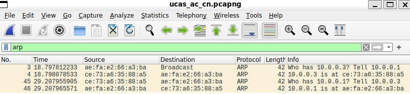
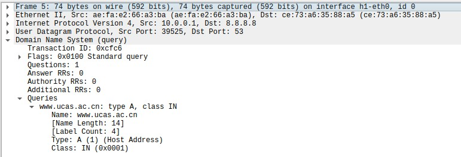
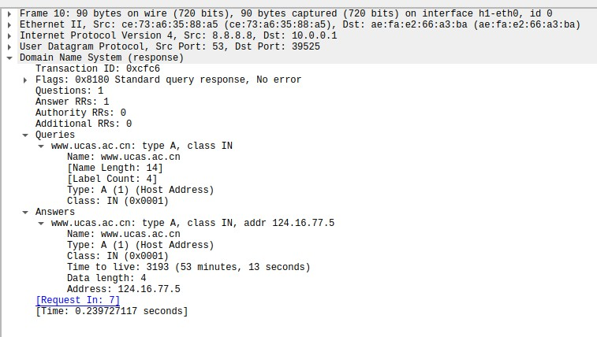
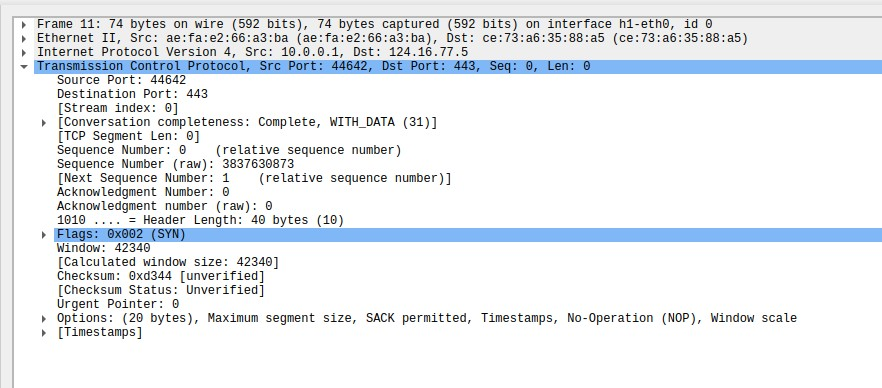
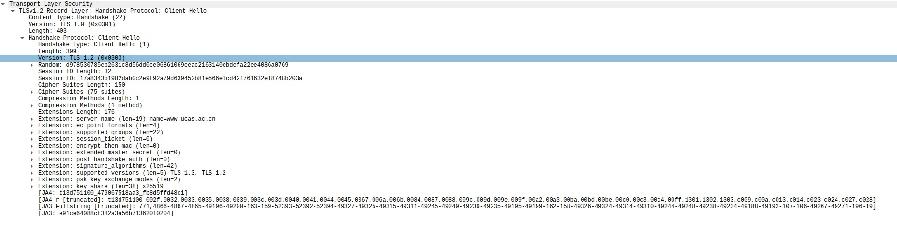
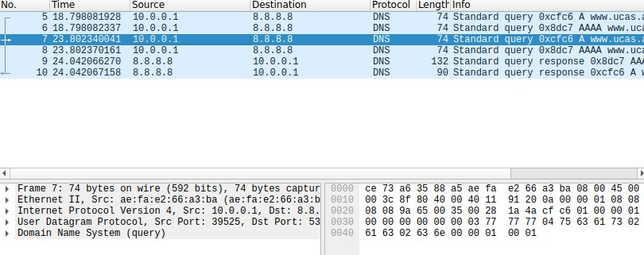
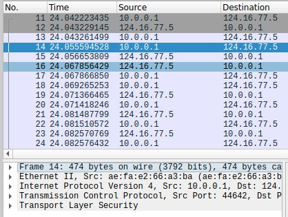
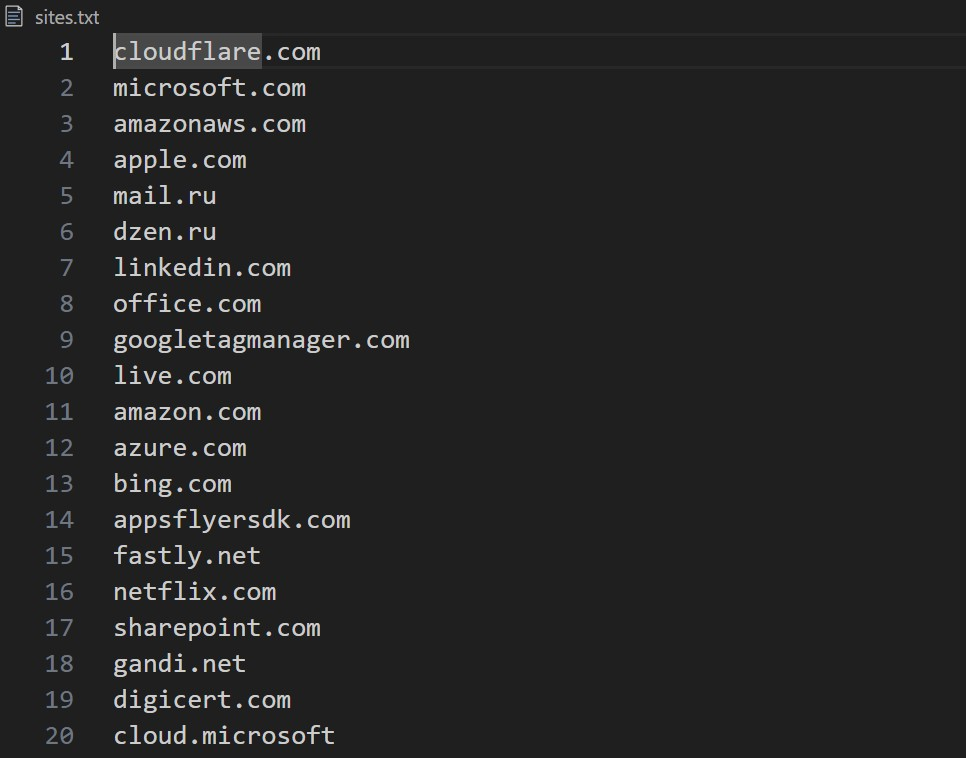
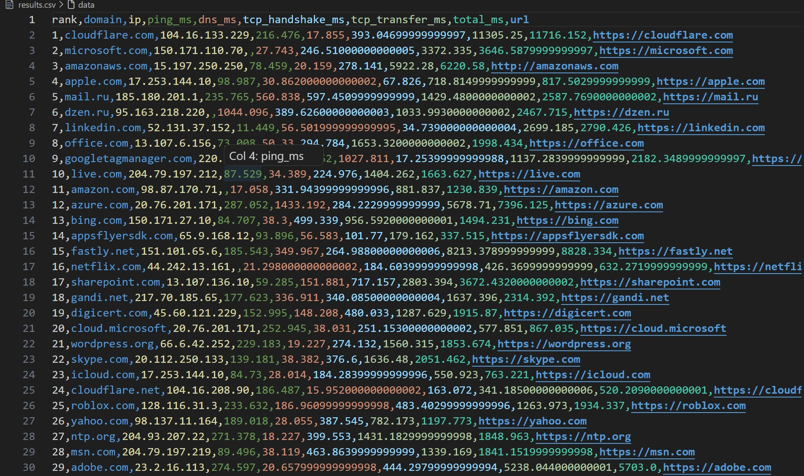
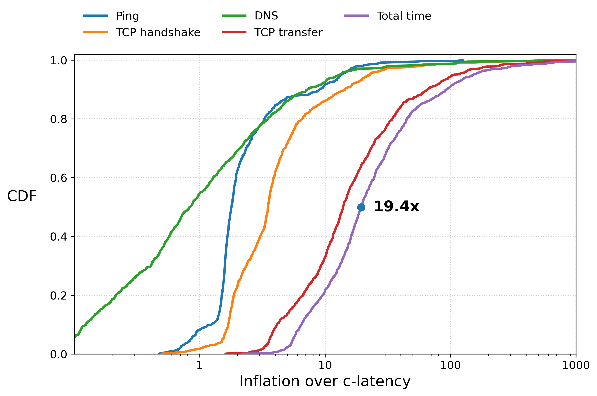

# 实验报告

张晨轩 2024K8009929011

## 1 互联网协议分析实验

### 1.1 实验内容

本实验用mininet搭建网络环境，在节点h1上启动wireshark，对`h1-eth0`网卡抓包，再用 `wget` 获取 `www.ucas.ac.cn` 的页面。

结合wireshark捕获的数据包，查看ARP、DNS、TCP、HTTP/HTTPS等协议在网页获取过程中起到的作用，以及不同协议之间的封装关系，了解h1获取页面时各协议是怎样运行的。

### 1.2 实验流程

- 启动带有NAT功能的mininet网络，命令为`sudo mn --nat`

- 在mininet中打开h1的终端，输入`mininet> xterm h1`

- 在h1中配置DNS服务器，使用`echo "nameserver 8.8.8.8" > /etc/resolv.conf`

- 在h1中输入`wireshark &`，启动wireshark

- 在wireshark中选中 `h1-eth0` 网卡，开始抓包

- 用以下命令访问 UCAS 网站：`wget -U "Mozilla/5.0 (Windows NT 10.0; Win64; x64) AppleWebKit/537.36 (KHTML, like Gecko) Chrome/123.0 Safari/537.36" https://www.ucas.ac.cn`

网页访问结束后，停止wireshark抓包，再分别查看ARP、DNS、TCP和HTTPS数据包并进行分析。

### 1.3 实验结果及分析

#### 1.3.1 ARP协议分析

在wireshark中把过滤条件设为`arp`

过滤后能看到h1发出的ARP请求：

```
Who has 10.0.0.3? Tell 10.0.0.1
```

随后收到了与请求对应的ARP响应：

```
10.0.0.3 is at ce:73:a6:35:88:a5
```

抓包结果显示，h1的IP地址为 `10.0.0.1`，需要把数据发送到下一跳 `10.0.0.3`；数据链路层发送 Ethernet帧时，需要知道下一跳设备的MAC地址，所以h1先用ARP查询 `10.0.0.3` 对应的MAC地址，收到的ARP响应给出了该地址对应的MAC地址：

```
ce:73:a6:35:88:a5
```

在本次实验中，ARP由此完成了下一跳IP地址到MAC地址的映射。



#### 1.3.2 DNS协议分析

在wireshark中把`dns`设为过滤条件

过滤结果中能看到h1向DNS服务器 `8.8.8.8` 发出的查询请求，A记录的查询内容如下：

```
Name: www.ucas.ac.cn
Type: A
Class: IN
```



随后，DNS服务器返回了响应，内容包括：

```
Name: www.ucas.ac.cn
Type: A
Address: 124.16.77.5
```

根据本次实验的响应结果，`www.ucas.ac.cn`的IP地址为`124.16.77.5`



该DNS请求的Transaction ID为`0xfcf6`，还能看到以下内容：

```
Answer RRs: 1
Request In: 7
Time: 0.239727117 seconds
```

由此可知，从对应请求发出到收到响应，经过的时间约为0.24s

抓包时还看到了AAAA类型的DNS查询，A记录用来查询域名对应的IPv4地址，AAAA记录则用来查询IPv6地址。

本实验中，DNS把用户输入的域名 `www.ucas.ac.cn` 映射为IP地址 `124.16.77.5`，供网络层使用。

#### 1.3.3 TCP协议分析

完成DNS 解析后，h1开始与服务器 `124.16.77.5` 建立TCP连接。

这次连接的基本信息记录如下：

```
客户端 IP：10.0.0.1
客户端端口：44642
服务器 IP：124.16.77.5
服务器端口：443
TCP Stream index：0
```

在wireshark中能看到TCP三次握手的顺序：`SYN -> SYN,ACK -> ACK`

其中，`10.0.0.1:44642`发起`SYN`和`ACK`，对`SYN,ACK`作出应答；`124.16.77.5:443`发起`SYN,ACK`，应答的内容为`SYN`和`ACK`

三次握手各自对应的时间如下：

```
SYN：24.042223435 s
SYN, ACK：24.043229145 s
ACK：24.043261499 s
```

根据记录，从`SYN`到`SYN, ACK`的时间差约为**1.01ms**


再打开第一个SYN包，能看到以下信息：

```
Source Port: 44642
Destination Port: 443
Sequence Number: 0
Flags: SYN
```



TCP 三次握手时，客户端先发送SYN来请求建立连接，服务器返回SYN和 ACK，表示同意建立连接，并确认已收到客户端的请求；客户端再发送 ACK 作出确认，三次握手完成后，双方的TCP连接便建立了。

#### 1.3.4 HTTPS协议分析

本实验访问的地址是`https://www.ucas.ac.cn`，服务器端口为 `443`，所以建立TCP连接后，还要进行TLS握手。

在wireshark中能看到TLS Client Hello数据包，包含以下内容：

```
Handshake Protocol: Client Hello
Server Name: www.ucas.ac.cn
```



HTTPS在HTTP与TCP之间加入了TLS加密层，建立TCP连接后，还要通过TLS握手协商后续加密通信需要的信息；完成这一步后，HTTP请求和服务器返回的数据会通过TLS加密传输。

因此，普通wireshark抓包无法直接看到完整的HTTP明文请求内容，本次把过滤器设为`http`后，没有找到符合条件的包。

#### 1.3.5 协议封装关系

查看DNS查询数据包，能看到：

```
Ethernet II
Internet Protocol Version 4
User Datagram Protocol
Domain Name System
```

对应的协议封装关系为`Ethernet < IP < UDP < DNS`



查看HTTPS数据包，能看到：

```
Ethernet II
Internet Protocol Version 4
Transmission Control Protocol
Transport Layer Security
```

对应的封装关系为`Ethernet < IP < TCP < TLS`



#### 1.3.6 UCAS 页面获取过程

- 用户使用 `wget`，请求访问`https://www.ucas.ac.cn`

- 此时客户端只知道域名，还没有服务器的IP地址，需要先向DNS服务器 `8.8.8.8` 发送DNS查询，DNS 返回`www.ucas.ac.cn -> 124.16.77.5`
  - 得到服务器IP地址后，客户端还需要通过网络把数据发送出去

- 发送Ethernet帧前，h1 用ARP查询下一跳 `10.0.0.3` 的MAC地址，得到的结果为`10.0.0.3 -> ce:73:a6:35:88:a5`

- h1通过本地端口 `44642` 与服务器 `124.16.77.5:443` 建立TCP连接，双方按顺序完成`SYN`、`SYN,ACK`、`ACK`三次握手

- 建立TCP连接后，因为访问的是HTTPS网站，客户端还会发送TLS Client Hello，与服务器建立加密连接
  - 随后的HTTP请求及网页响应通过TLS加密，后续数据传输由TCP完成

----------

## 2 传输性能测量实验

### 2.1 实验内容

本实验在Linux环境下用python编写测量脚本，对约1000个网站的网络传输性能进行测量。

测量主要记录以下几项指标：

- Ping
- DNS
- TCP transfer
- Total time

测量时也记录了TCP握手时间，便于进一步查看传输过程中不同阶段各自的时间开销。

获得网站服务器的 IP 地址后，用GeoIP数据库查询服务器的大致地理位置，再根据客户端与服务器之间的地理距离，估算理论传播时延c-latency，并把实际网络传输性能与 c-latency 作比较。

### 2.2 实验流程

#### 2.2.1 测试网站选取

从 Tranco 网站排名数据中，按照排名顺序依次读取域名。

部分网站在当前网络环境下不能正常解析或访问，因此编写了筛选脚本，对候选网站逐个做DNS解析和HTTP/HTTPS可访问性测试

筛选脚本共选出了 1000 个能正常解析和访问的网站，把结果保存到`sites.txt`



筛选使用的脚本`filter_sites.py`如下：

```python
import csv
import socket
import subprocess
import time

INPUT_FILE = "tranco_Q2Q44.csv"
OUTPUT_FILE = "sites.txt"

TARGET_COUNT = 1000
SITE_TIMEOUT = 8 # 设置最大测试时长
CONNECT_TIMEOUT = 3


def can_resolve(domain):
    try:
        socket.setdefaulttimeout(SITE_TIMEOUT)
        socket.gethostbyname(domain)
        return True
    except Exception:
        return False


def can_access(domain, remaining_time):
    if remaining_time <= 0:
        return False

    schemes = ["https", "http"]

    for scheme in schemes:
        if remaining_time <= 0:
            return False

        url = f"{scheme}://{domain}"

        max_time = max(1, int(remaining_time))

        try:
            result = subprocess.run(
                [
                    "curl",
                    "--noproxy", "*",
                    "-L",
                    "-o", "/dev/null",
                    "-s",
                    "--connect-timeout", str(CONNECT_TIMEOUT),
                    "--max-time", str(max_time),
                    url,
                ],
                stdout=subprocess.DEVNULL,
                stderr=subprocess.DEVNULL,
                timeout=remaining_time + 1,
            )

            if result.returncode == 0:
                return True

        except subprocess.TimeoutExpired:
            return False
        except Exception:
            pass

        return False

    return False


def valid_site(domain):
    start = time.monotonic()

    if not can_resolve(domain):
        return False

    elapsed = time.monotonic() - start
    remaining = SITE_TIMEOUT - elapsed

    if remaining <= 0:
        return False

    return can_access(domain, remaining)


def main():
    count = 0
    checked = 0

    with open(INPUT_FILE, "r", encoding="utf-8-sig", newline="") as f, \
         open(OUTPUT_FILE, "w", encoding="utf-8") as out:

        reader = csv.reader(f)

        for row in reader:
            if len(row) < 2:
                continue

            domain = row[1].strip()

            if not domain:
                continue

            checked += 1

            print(
                f"[checked={checked}, valid={count}/{TARGET_COUNT}] "
                f"testing {domain} ..."
            )

            start = time.monotonic()
            ok = valid_site(domain)
            elapsed = time.monotonic() - start

            if ok:
                count += 1
                out.write(domain + "\n")
                out.flush()

                print(
                    f"  OK ({elapsed:.2f}s) "
                    f"-> saved as #{count}"
                )
            else:
                print(
                    f"  FAIL ({elapsed:.2f}s)"
                )

            if count >= TARGET_COUNT:
                break

    print()
    print(f"Checked sites: {checked}")
    print(f"Valid sites:   {count}")
    print(f"Output:        {OUTPUT_FILE}")


if __name__ == "__main__":
    main()

```

#### 2.2.2 网络性能测量

用python编写 `measure.py`，依次读取 `sites.txt` 中的网站并进行测量。

测量每个网站时，先通过 DNS 解析得到服务器的 IPv4 地址，再用 `ping` 测量网络 RTT；同时用 `curl` 获取 DNS 解析、TCP 建连，以及整个页面传输过程的时间信息。

程序会把以下字段记录下来：

```
rank
domain
ip
ping_ms
dns_ms
tcp_handshake_ms
tcp_transfer_ms
total_ms
url
```

各项时间的计算方式如下：

- `DNS time = time_namelookup`

- TCP三次握手时间按以下方式计算：`TCP handshake = time_connect - time_namelookup`

- TCP transfer的计算方式为`TCP transfer = time_total - time_connect`

- 总传输时间记为`Total time = time_total`

把测量得到的结果保存到`results.csv`



本次一共测试了 1000 个网站，有效结果统计如下：

```
测试网站总数：1000
IP 解析成功：1000
Ping 测量成功：824
HTTP 测量成功：992
```

测量脚本`measure.py`如下：

```python
import csv
import re
import socket
import subprocess
import time

INPUT_FILE = "sites.txt"
OUTPUT_FILE = "results.csv"

PING_COUNT = 3
TIMEOUT = 10


def resolve_ip(domain):
    try:
        return socket.gethostbyname(domain)
    except Exception:
        return ""


def measure_ping(domain):
    try:
        result = subprocess.run(
            ["ping", "-c", str(PING_COUNT), "-W", "2", domain],
            stdout=subprocess.PIPE,
            stderr=subprocess.DEVNULL,
            text=True,
            timeout=10,
        )

        m = re.search(
            r"rtt min/avg/max/mdev = [\d.]+/([\d.]+)/",
            result.stdout
        )

        if m:
            return float(m.group(1))

    except Exception:
        pass

    return None


def measure_curl(domain):
    fmt = (
        "%{time_namelookup},"
        "%{time_connect},"
        "%{time_total}"
    )

    urls = [
        f"https://{domain}",
        f"http://{domain}",
    ]

    for url in urls:
        try:
            result = subprocess.run(
                [
                    "curl",
                    "--noproxy", "*",
                    "-L",
                    "-o", "/dev/null",
                    "-s",
                    "--connect-timeout", str(TIMEOUT),
                    "--max-time", "20",
                    "-w", fmt,
                    url,
                ],
                stdout=subprocess.PIPE,
                stderr=subprocess.DEVNULL,
                text=True,
                timeout=25,
            )

            if result.returncode != 0:
                continue

            values = result.stdout.strip().split(",")

            if len(values) != 3:
                continue

            dns = float(values[0])
            connect = float(values[1])
            total = float(values[2])

            if total <= 0:
                continue

            dns_ms = dns * 1000
            tcp_handshake_ms = max(0, (connect - dns) * 1000)
            tcp_transfer_ms = max(0, (total - connect) * 1000)
            total_ms = total * 1000

            return (
                dns_ms,
                tcp_handshake_ms,
                tcp_transfer_ms,
                total_ms,
                url,
            )

        except Exception:
            continue

    return None


def main():
    with open(INPUT_FILE, "r", encoding="utf-8") as f:
        domains = [
            line.strip()
            for line in f
            if line.strip()
        ]

    with open(
        OUTPUT_FILE,
        "w",
        newline="",
        encoding="utf-8"
    ) as f:

        writer = csv.writer(f)

        writer.writerow([
            "rank",
            "domain",
            "ip",
            "ping_ms",
            "dns_ms",
            "tcp_handshake_ms",
            "tcp_transfer_ms",
            "total_ms",
            "url",
        ])

        for rank, domain in enumerate(domains, 1):
            print(f"[{rank}/{len(domains)}] {domain}")

            ip = resolve_ip(domain)
            ping_ms = measure_ping(domain)
            curl_result = measure_curl(domain)

            if curl_result:
                (
                    dns_ms,
                    handshake_ms,
                    transfer_ms,
                    total_ms,
                    url,
                ) = curl_result
            else:
                dns_ms = None
                handshake_ms = None
                transfer_ms = None
                total_ms = None
                url = ""

            writer.writerow([
                rank,
                domain,
                ip,
                ping_ms,
                dns_ms,
                handshake_ms,
                transfer_ms,
                total_ms,
                url,
            ])

            f.flush()

            time.sleep(0.1)


if __name__ == "__main__":
    main()

```

#### 2.2.3 GeoIP获取和c-latency计算

##### 2.2.3.1 服务器位置获取

根据 `results.csv` 中得到的服务器 IP 地址，在DB-IP City Lite GeoIP数据库中查询对应的大致地理位置，记录的内容包括：

```
country
city
latitude
longitude
```

客户端位置以实验所在的北京市怀柔区作近似，经纬度按以下数值设置：

```
Latitude  = 40.3160
Longitude = 116.6318
```

python脚本按上述设置计算距离，再把结果保存到`results_geo.csv`


##### 2.2.3.2 c-latency计算

课件给出的光速网络传播时延模型如下：\[ L=\frac{D}{0.6C} \]

其中，$D$ 表示传播距离，$C$ 表示光速，光纤中的传播速度近似取为 $0.6C$。

本实验的 Ping 测量值是往返时延 RTT，所以计算对应的 c-latency 时，需要用到往返距离：\[ c\text{-latency} = \frac{2D}{0.6C} \]

数据处理所用的脚本`geo.py`如下：

```python
import math
import pandas as pd
import geoip2.database

INPUT_FILE = "results.csv"
OUTPUT_FILE = "results_geo.csv"
DB_FILE = "dbip-city-lite-2026-09.mmdb"

CLIENT_LAT = 40.3160
CLIENT_LON = 116.6318


def haversine(lat1, lon1, lat2, lon2):
    R = 6371.0

    phi1 = math.radians(lat1)
    phi2 = math.radians(lat2)

    dphi = math.radians(lat2 - lat1)
    dlambda = math.radians(lon2 - lon1)

    a = (
        math.sin(dphi / 2) ** 2
        + math.cos(phi1)
        * math.cos(phi2)
        * math.sin(dlambda / 2) ** 2
    )

    c = 2 * math.atan2(
        math.sqrt(a),
        math.sqrt(1 - a)
    )

    return R * c


def c_latency_rtt_ms(distance_km):
    speed_km_s = 0.6 * 300000
    return (
        2 * distance_km / speed_km_s
    ) * 1000


df = pd.read_csv(INPUT_FILE)

reader = geoip2.database.Reader(DB_FILE)

server_latitudes = []
server_longitudes = []
countries = []
cities = []
distances = []
c_latencies = []

for ip in df["ip"]:

    try:
        response = reader.city(ip)

        lat = response.location.latitude
        lon = response.location.longitude

        country = response.country.name
        city = response.city.name

        if lat is None or lon is None:
            raise ValueError()

        distance = haversine(
            CLIENT_LAT,
            CLIENT_LON,
            lat,
            lon
        )

        c_latency = c_latency_rtt_ms(distance)

    except Exception:
        lat = None
        lon = None
        country = None
        city = None
        distance = None
        c_latency = None

    server_latitudes.append(lat)
    server_longitudes.append(lon)
    countries.append(country)
    cities.append(city)
    distances.append(distance)
    c_latencies.append(c_latency)

reader.close()

df["server_lat"] = server_latitudes
df["server_lon"] = server_longitudes
df["country"] = countries
df["city"] = cities
df["distance_km"] = distances
df["c_latency_ms"] = c_latencies

df.to_csv(
    OUTPUT_FILE,
    index=False
)

print(f"Saved to {OUTPUT_FILE}")
```

### 2.3 实验结果及分析

把各项实际测量时间除以 c-latency，得到相对理论传播时延的膨胀倍数，再据此绘制 CDF 曲线。



图中DNS和Ping的膨胀倍数整体较小，TCP handshake稍大一些，TCP transfer和Total time则明显更大；Total time的中位膨胀倍数约为19.4×，说明实际的完整传输时间通常比仅按传播距离计算的理论时延要长得多。

这一差异主要来自两方面，一是实际网络路径比地理直线距离更长，二是传输过程中还有发送延迟、队列延迟和TCP建连等额外开销。

部分样本的实际Ping小于估算的c-latency，主要是因为GeoIP只能大致估计服务器位置，加上 CDN、云服务等机制的影响，实际响应节点可能与数据库记录的位置不同。

绘图使用的脚本`plot.py`如下：

```python
import pandas as pd
import numpy as np
import matplotlib.pyplot as plt

INPUT_FILE = "results_geo.csv"
OUTPUT_FILE = "cdf_inflation.png"

DRAW_ROUTER_PATH = False

def prepare_ratio(df, metric, c_col="c_latency_ms"):
    data = df[[metric, c_col]].dropna().copy()

    data = data[
        (data[metric] > 0) &
        (data[c_col] > 0)
    ]

    ratio = data[metric] / data[c_col]

    ratio = ratio.replace([np.inf, -np.inf], np.nan).dropna()

    return ratio.values


def ecdf(values):
    x = np.sort(values)
    y = np.arange(1, len(x) + 1) / len(x)
    return x, y

def add_curve(ax, values, label, linewidth=2.5):
    if len(values) == 0:
        print(f"Warning: no valid data for {label}")
        return None

    x, y = ecdf(values)

    line, = ax.plot(
        x,
        y,
        linewidth=linewidth,
        label=label
    )

    return line


def main():
    df = pd.read_csv(INPUT_FILE)

    required = [
        "ping_ms",
        "dns_ms",
        "tcp_handshake_ms",
        "tcp_transfer_ms",
        "total_ms",
        "c_latency_ms",
    ]

    missing = [c for c in required if c not in df.columns]

    if missing:
        raise ValueError(
            f"Missing columns in {INPUT_FILE}: {missing}"
        )

    ping_ratio = prepare_ratio(df, "ping_ms")
    dns_ratio = prepare_ratio(df, "dns_ms")
    handshake_ratio = prepare_ratio(df, "tcp_handshake_ms")
    transfer_ratio = prepare_ratio(df, "tcp_transfer_ms")
    total_ratio = prepare_ratio(df, "total_ms")

    print("Valid samples:")
    print("Min Ping:", len(ping_ratio))
    print("DNS:", len(dns_ratio))
    print("TCP handshake:", len(handshake_ratio))
    print("TCP transfer:", len(transfer_ratio))
    print("Total time:", len(total_ratio))

    router_ratio = None

    if DRAW_ROUTER_PATH:
        if "router_path_ms" in df.columns:
            router_ratio = prepare_ratio(df, "router_path_ms")
        else:
            print(
                "Warning: DRAW_ROUTER_PATH=True, "
                "but router_path_ms not found."
            )

    fig, ax = plt.subplots(figsize=(9, 6))

    lines = []

    if router_ratio is not None:
        line = add_curve(
            ax,
            router_ratio,
            "Router-path"
        )
        if line:
            lines.append(line)

    for values, label in [
        (ping_ratio, "Ping"),
        (handshake_ratio, "TCP handshake"),
        (dns_ratio, "DNS"),
        (transfer_ratio, "TCP transfer"),
        (total_ratio, "Total time"),
    ]:
        line = add_curve(
            ax,
            values,
            label
        )

        if line:
            lines.append(line)

    ax.set_xscale("log")

    ax.set_xlim(0.1, 1000)
    ax.set_ylim(0, 1.02)

    ax.set_xlabel(
        "Inflation over c-latency",
        fontsize=16
    )

    ax.set_ylabel(
        "CDF",
        fontsize=16,
        rotation=0,
        labelpad=30
    )

    ax.grid(
        True,
        which="major",
        linestyle=":",
        linewidth=1,
        alpha=0.6
    )

    ax.set_yticks(
        np.arange(0, 1.01, 0.2)
    )

    ax.set_xticks(
        [1, 10, 100, 1000]
    )

    ax.get_xaxis().set_major_formatter(
        plt.ScalarFormatter()
    )

    ax.tick_params(
        axis="both",
        labelsize=12
    )

    ax.legend(
        loc="lower left",
        bbox_to_anchor=(0.0, 1.02),
        ncol=3,
        frameon=False,
        fontsize=12
    )

    if len(total_ratio) > 0:
        median_total = np.median(total_ratio)

        x_total, y_total = ecdf(total_ratio)

        idx = np.argmin(
            np.abs(y_total - 0.5)
        )

        x50 = x_total[idx]
        y50 = y_total[idx]

        ax.scatter(
            [x50],
            [y50],
            s=60,
            zorder=5
        )

        ax.text(
            x50 * 1.25,
            y50,
            f"{median_total:.1f}x",
            fontsize=16,
            fontweight="bold",
            va="center"
        )

    plt.tight_layout()

    plt.savefig(
        OUTPUT_FILE,
        dpi=300,
        bbox_inches="tight"
    )

    print(f"Saved figure to {OUTPUT_FILE}")

    plt.show()


if __name__ == "__main__":
    main()
```