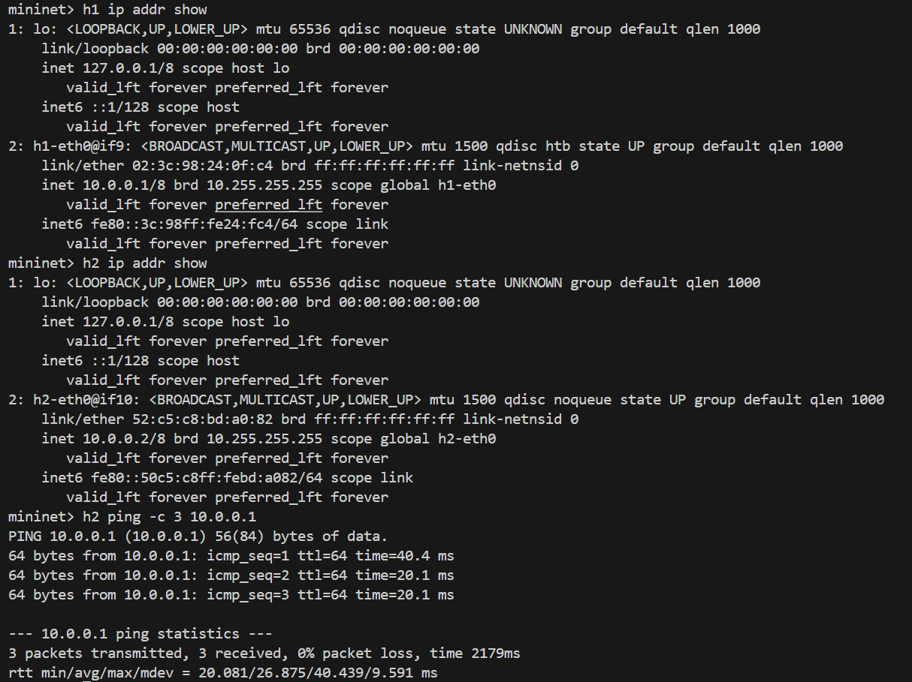
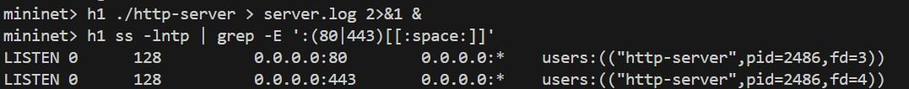
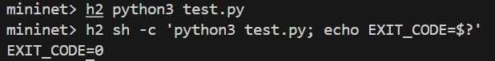
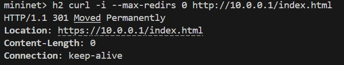
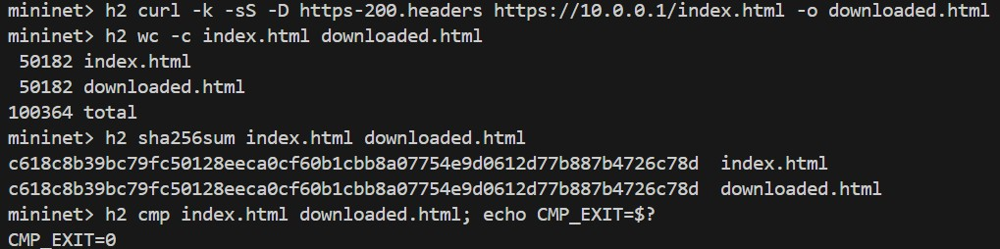
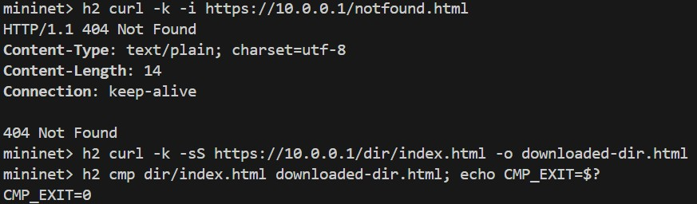
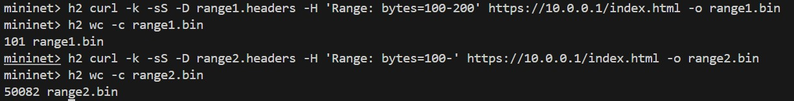

# 02 Socket 应用编程实验报告

张晨轩 2024K8009929011

## 1 实验目的

本实验使用 C 语言和 BSD Socket API 实现一个简单的 HTTP/HTTPS 文件服务器。实验的主要目标如下：

1. 熟悉 TCP 服务器建立连接的基本过程，包括 `socket`、`bind`、`listen` 和 `accept`。
2. 理解 HTTP 请求行、请求头、状态行、响应头和响应体的格式。
3. 使用 OpenSSL 建立 HTTPS 连接，掌握证书、私钥和 TLS 握手的基本用法。
4. 正确实现 301、200、206 和 404 响应。
5. 使用多线程处理并发连接，使慢连接不会阻塞其他客户端。
6. 支持 HTTP/1.1 持久连接，保证同一连接内的响应顺序正确。

## 2 实验原理

### 2.1 TCP Socket 服务器流程

TCP 服务器先通过 `socket` 创建套接字，然后使用 `bind` 绑定本地地址和端口，通过 `listen` 进入监听状态。客户端发起连接后，服务器使用 `accept` 得到与该客户端对应的新文件描述符。监听套接字继续接收其他连接，新文件描述符负责当前连接的数据收发。

```text
socket -> bind -> listen -> accept -> recv/send -> close
```

本实验同时监听 80 和 443 端口，因此程序创建两个监听线程。每次 `accept` 成功后，再创建一个独立工作线程处理客户端，避免某个慢客户端阻塞监听线程。

### 2.2 HTTP 请求与响应

HTTP 请求头以空行结束，也就是字节序列 `\r\n\r\n`。服务器需要先解析请求行中的方法、路径和版本，再读取 `Host`、`Range` 和 `Connection` 等请求头。

本实验使用的主要状态码如下：

| 状态码 | 使用场景 |
| --- | --- |
| `301 Moved Permanently` | 80 端口将 HTTP 请求重定向到同一路径的 HTTPS URL |
| `200 OK` | HTTPS 请求的文件存在，并且客户端未请求部分内容 |
| `206 Partial Content` | 文件存在，并且请求头中包含合法的 `Range` |
| `404 Not Found` | 请求路径不存在或不是普通文件 |
| `416 Range Not Satisfiable` | Range 格式错误或范围超出文件大小 |

HTTP/1.1 默认使用持久连接。程序处理完一条请求后，如果客户端没有要求 `Connection: close`，就继续从同一个连接读取下一条请求。这样既便于进行多请求交错测试，又能减少重复建立 TCP 连接的开销。

### 2.3 HTTPS 与 TLS

HTTPS 本质上是在 TLS 连接之上运行 HTTP。服务器启动时加载 `keys/cnlab.cert` 和 `keys/cnlab.prikey`，创建共享的 `SSL_CTX`。每接受一个 HTTPS 连接，工作线程都会创建独立的 `SSL` 对象并执行 `SSL_accept`。

证书和私钥用于证明服务器身份并协商加密参数。实验使用自签名证书，因此测试客户端需要关闭证书可信性检查，但 TLS 握手与加密过程依然照常进行。

### 2.4 Range 分段传输

当请求中包含：

```http
Range: bytes=100-200
```

服务器返回文件第 100 到 200 字节。范围两端都包含在结果中，所以响应长度为：

```text
200 - 100 + 1 = 101 字节
```

对于 `Range: bytes=100-`，结束位置为文件最后一个字节。服务器返回 `206 Partial Content`，同时设置 `Content-Range`、`Content-Length` 和 `Accept-Ranges`。

## 3 程序设计

### 3.1 总体结构

程序主要由主线程、两个监听线程和若干工作线程组成。

```text
main
├── 初始化 OpenSSL 和 SSL_CTX
├── HTTP 监听线程：监听 80 端口
│   └── 每个客户端对应一个工作线程，返回 301
└── HTTPS 监听线程：监听 443 端口
    └── 每个客户端对应一个工作线程，完成 TLS 后返回文件或错误响应
```

### 3.2 统一连接接口

程序使用 `struct connection` 保存 Socket 文件描述符和可选的 `SSL *`。当 `SSL *` 为空时，使用 `recv` 和 `send`；否则使用 `SSL_read` 和 `SSL_write`。这种封装使 HTTP 与 HTTPS 可以复用请求解析和响应发送代码。

`send` 和 `SSL_write` 都可能只发送部分数据，因此程序通过 `connection_write_all` 循环发送，直到指定长度全部写出或发生错误。

### 3.3 请求缓冲与持久连接

TCP 是字节流，一次读取可能只得到半条请求，也可能同时得到多条请求。程序使用 `request_buffer` 保存尚未处理的数据：

- 找不到 `\r\n\r\n` 时继续读取，因此支持慢连接分段发送。
- 找到完整请求后只取出第一条请求。
- 已经读到的后续请求保留在缓冲区中，下一轮继续处理。
- 同一工作线程顺序处理同一连接中的请求，因此响应不会串线。

### 3.4 路径处理

服务器将 URL 路径映射到当前工作目录中的文件。根路径 `/` 对应 `./index.html`，目录路径默认查找目录下的 `index.html`。路径转换时会：

1. 去除查询字符串和片段标识。
2. 处理 `%xx` 百分号编码。
3. 拒绝控制字符、反斜杠和 `..` 路径段。
4. 根据文件扩展名设置常用的 `Content-Type`。

这样既能访问 `dir/index.html`，也能避免客户端读取工作目录之外的文件。

### 3.5 并发处理

监听线程只负责接受新连接。每个连接由一个 detached 工作线程处理，工作线程退出时自动回收线程控制资源。为客户端 Socket 设置了收发超时时间，以防止异常连接长期占用线程。

这种实现能够满足以下场景：

- 客户端 A 只发送部分请求时，客户端 B 仍能立即得到响应。
- 50 个客户端可以同时建立连接和发送请求。
- A、B 两条连接交错发送 A1、B1、A2、B2 时，各自连接内的响应顺序保持正确。

## 4 实验步骤

### 4.1 编译

编译命令如下：

```bash
make
```

### 4.2 启动 Mininet

在包含 `topo.py`、证书和测试网页的实验工作目录中运行：

```bash
sudo python3 topo.py
```

进入 Mininet 后检查主机地址和连通性：

```text
mininet> h1 ip addr show
mininet> h2 ip addr show
mininet> h2 ping -c 3 10.0.0.1
```



### 4.3 启动服务器

```text
mininet> h1 ./http-server > server.log 2>&1 &
mininet> h1 ss -lntp | grep -E ':(80|443)[[:space:]]'
```



### 4.4 运行测试

按实际路径运行本地测试：

```text
mininet> h2 python3 test.py
```

测试脚本成功时没有普通输出，因此同时记录退出码：

```text
mininet> h2 sh -c 'python3 test.py; echo EXIT_CODE=$?'
```



## 5 实验结果

| 测试项 | 预期结果 |
| --- | --- |
| `http_301_test` | HTTP 返回 301，Location 指向同路径 HTTPS |
| `https_200_test` | HTTPS 返回 200，文件内容完全一致 |
| `http_200_test` | HTTP 重定向后最终获得正确文件 |
| `http_404_test` | 不存在的文件最终返回 404 |
| `http_in_dir_test` | 子目录文件内容正确 |
| `http_range1_test` | 固定范围返回 206，长度和内容正确 |
| `http_range2_test` | 开放结束范围返回 206，内容到文件末尾 |
| `slow_conn_test` | A 的半包不阻塞 B；A 补全后也能完成 |
| `multi_conn_test` | 50 个连接成功；至少 95% 在 2 秒内，全部在 10 秒内 |
| `interleave_test` | 多连接交错发送时不串线，同一连接顺序正确 |

部分测试项可通过本地测试验证，报告中附有相应截图；其余测试项仅给出 OJ 的验收结果，详见 5.5 节。

### 5.1 301 验证

```text
mininet> h2 curl -i --max-redirs 0 http://10.0.0.1/index.html
```



### 5.2 200 与文件一致性

```text
mininet> h2 curl -k -sS -D https-200.headers https://10.0.0.1/index.html -o downloaded.html
mininet> h2 wc -c index.html downloaded.html
mininet> h2 sha256sum index.html downloaded.html
mininet> h2 cmp index.html downloaded.html; echo CMP_EXIT=$?
```



### 5.3 404 与子目录

```text
mininet> h2 curl -k -i https://10.0.0.1/notfound.html
mininet> h2 curl -k -sS https://10.0.0.1/dir/index.html -o downloaded-dir.html
mininet> h2 cmp dir/index.html downloaded-dir.html; echo CMP_EXIT=$?
```



### 5.4 Range 验证

```text
mininet> h2 curl -k -sS -D range1.headers -H 'Range: bytes=100-200' https://10.0.0.1/index.html -o range1.bin
mininet> h2 wc -c range1.bin
mininet> h2 curl -k -sS -D range2.headers -H 'Range: bytes=100-' https://10.0.0.1/index.html -o range2.bin
mininet> h2 wc -c range2.bin
```



### 5.5 OJ 验收


## 6 实验总结

本实验完成了一个同时支持 HTTP 和 HTTPS 的多线程文件服务器。程序能够把 HTTP 请求重定向到 HTTPS，并根据文件和 Range 情况返回 200、206、404 或 416。通过本实验，我进一步理解了 Socket 服务器的建立流程，以及 HTTP 报文边界、TLS 连接、部分读写与线程并发之间的联系。
